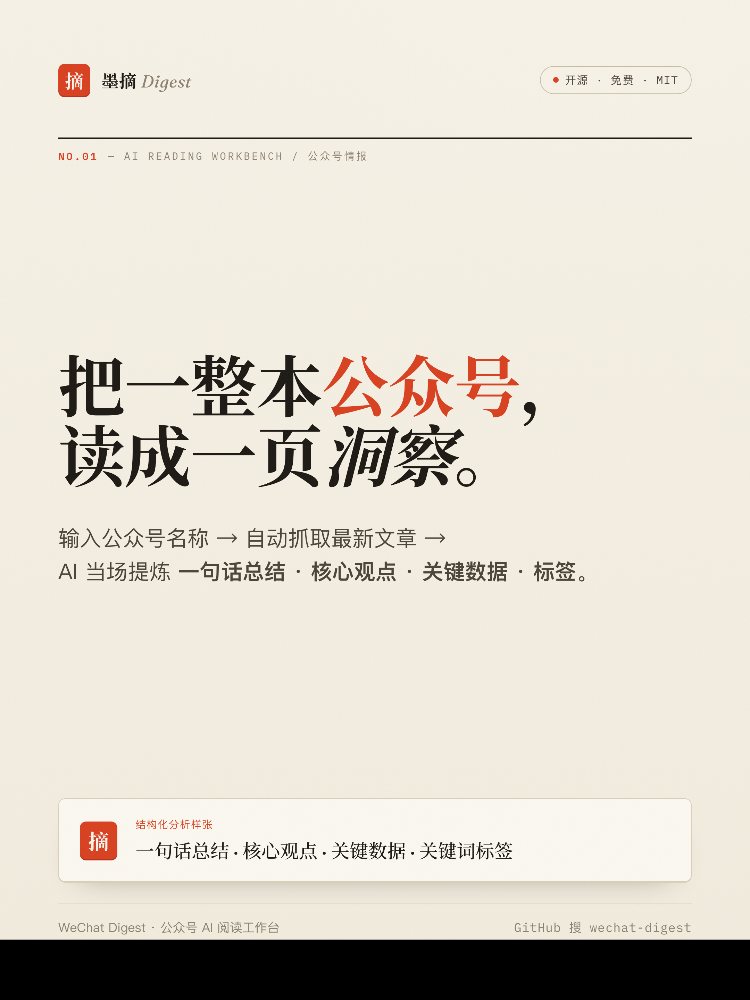
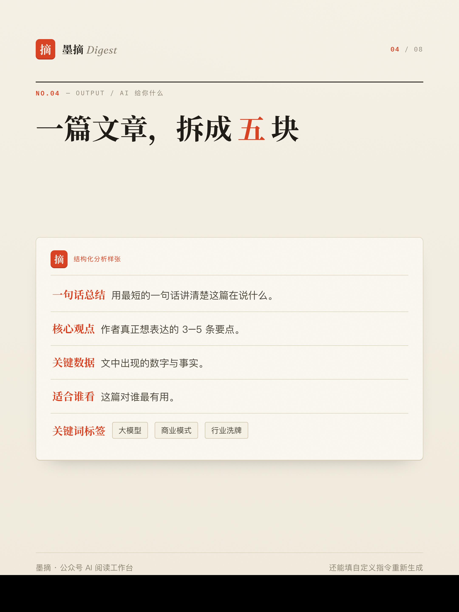

<div align="center">

# 墨摘 WeChat Digest

**AI 公众号抓取与结构化分析**

<sub>输入公众号名称，自动抓取最新文章，AI 一键完成总结与结构化分析</sub>

[](https://jackychen-12.github.io/wechat-digest/)

[](https://jackychen-12.github.io/wechat-digest/)
[](https://deno.com/deploy)
[](https://deno.com/kv)
[](https://platform.openai.com/)
[](https://github.com/Jackychen-12/wechat-digest/actions)
[](./LICENSE)

</div>

---

## 📸 预览

<p align="center">
  
  &nbsp;
  
</p>

---

## ✨ 能做什么

| 能力 | 说明 |
| --- | --- |
| **按名称自动抓取** | 输入公众号名称 → 后端代理搜狗微信搜索（带 cookie 预热 / UA 轮换 / 重试 / 缓存）→ 拉取文章列表并解析正文 |
| **粘贴链接解析** | 直接粘贴 `mp.weixin.qq.com` 文章链接（或搜狗跳转链接），自动解析并清洗为纯净正文 |
| **AI 结构化分析** | 自动输出「一句话总结 / 核心观点 / 关键数据 / 关键词标签 / 适用人群」，流式输出 |
| **批量自动化** | 导入后可自动分析，或一键批量分析全部未分析文章 |
| **多模型切换** | OpenAI、DeepSeek、通义千问任意切换；国产模型经后端代理转发，绕过浏览器 CORS |
| **工作区码同步** | 每个访客自动获得专属工作区码，文章与分析存云端、按码隔离、互不重叠；换设备输入同码即可恢复 |
| **Key 仅本地** | API Key 只存浏览器 `localStorage`，**绝不写入云端工作区**，可随时清除 |

---

## 🚀 本地部署（推荐）

### 前提

- [Deno](https://deno.com/) 已安装（`curl -fsSL https://deno.land/install.sh | sh`）
- 一个 AI 模型的 API Key（推荐 [DeepSeek](https://platform.deepseek.com/)，国内可直连，价格低）

### 一键启动

```bash
git clone https://github.com/Jackychen-12/wechat-digest.git
cd wechat-digest
./start.sh
```

脚本会自动启动后端（端口 8000）和前端（端口 3000），打开浏览器访问 `http://localhost:3000` 即可使用。

> 首次使用需在页面「设置」中填写 **后端 API 地址** `http://localhost:8000` 和你的 **API Key**。

### 手动启动

如果 `start.sh` 不适用，也可以手动分两步启动：

```bash
# 终端 1：启动后端
deno run --allow-net --allow-env --unstable-kv backend/main.ts

# 终端 2：启动前端（任选一种）
npx serve -s . -l 3000          # Node.js 方式
python3 -m http.server 3000     # Python 方式
```

> ⚠️ 不能直接双击 `index.html` 打开——ES Module 需要 HTTP 服务器，`file://` 协议会报 CORS 错误。

---

## ☁️ 云端部署（可选）

如果你想让别人通过网址直接访问（而不是本地运行），可以部署到云端：

### ① 部署后端到 Deno Deploy（免费）

1. 登录 [dash.deno.com](https://dash.deno.com) → **New Project** → 关联本 GitHub 仓库
2. **Entrypoint** 选 `backend/main.ts`
3. 部署完成后会得到一个地址，例如 `https://wechat-digest.deno.dev`
4. Deno KV 自动可用，无需配置

### ② 部署前端到 GitHub Pages

1. 把后端地址填进 `js/config.js` 顶部：
   ```js
   export const BACKEND_BASE = "https://wechat-digest.deno.dev";
   ```
2. 仓库 Settings → Pages → Source 选 **GitHub Actions**，推送后自动部署

---

## 🔑 配置模型

首次使用，在页面「设置」中配置：

| 模型 | Key 获取 | 备注 |
| --- | --- | --- |
| DeepSeek | [platform.deepseek.com](https://platform.deepseek.com) | 国内可直连，推荐首选 |
| 通义千问 | [阿里云百炼控制台](https://dashscope.console.aliyun.com/) | OpenAI 兼容模式 |
| OpenAI | [platform.openai.com](https://platform.openai.com) | 需国外网络 |

API Key 仅保存在你的浏览器本地，不会上传到云端。

---

## 🧭 使用流程

1. 输入**公众号名称**（如"晚点LatePost"）→ 点「抓取文章」
2. 在弹窗中勾选要导入的文章（可勾选「导入后自动 AI 分析」）
3. 点击左侧文章列表中的任意文章 → 右侧查看 AI 结构化分析
4. 也可以直接粘贴文章链接 → 点「解析」导入
5. 「⚡ 一键分析未分析」可批量处理整个文章库
6. 在分析框下方可填写**自定义指令**（如「侧重投资视角」）重新生成

---

## 👥 多用户：匿名工作区码

无需注册登录。首次进入自动生成一串 **工作区码**（如 `a1b2-c3d4-e5f6-7890`）：

- 文章与分析按工作区码隔离，不同码之间完全互不重叠
- 复制码 → 在另一台设备输入 → 数据自动同步
- ⚠️ 工作区码即数据钥匙，请妥善保存、勿公开分享
- 未配置后端时自动降级为纯本地模式

---

## 🏗 架构

```
前端（纯静态 HTML + ES Modules，零构建）
  ├─ index.html / styles.css
  ├─ js/
  │   ├─ main.js          入口
  │   ├─ config.js         常量与 Provider 配置
  │   ├─ state.js          全局状态 + localStorage
  │   ├─ helpers.js        工具函数
  │   ├─ workspace.js      工作区码 + 云同步
  │   ├─ settings.js       设置面板
  │   ├─ render.js         列表 / 详情渲染
  │   ├─ crawl.js          搜狗搜索 + 文章抓取
  │   ├─ data.js           文章 CRUD + 导入导出
  │   ├─ events.js         事件绑定
  │   └─ skills/           AI 技能（可扩展）
  │       ├─ registry.js   技能注册表 + 通用调度引擎
  │       └─ digest.js     结构化摘要技能
  └─ 跨域调用 ↓
后端（Deno 单文件 backend/main.ts，零依赖）
  ├─ GET  /api/search?account=名称      搜狗微信搜索（KV 缓存 10min）
  ├─ GET  /api/article?url=链接         抓取清洗正文（KV 缓存 1d）
  ├─ GET/PUT /api/data?ws=工作区码       工作区数据读写
  └─ POST /api/chat                     LLM 流式代理（多 provider）
```

### 技能扩展

新增 AI 分析能力只需在 `js/skills/` 下新建文件：

```javascript
// js/skills/compare.js
import { registerSkill } from "./registry.js";

registerSkill({
  id: "compare",
  name: "多篇对比",
  icon: "⚖️",
  multi: true,
  buildPrompt(articles) {
    return {
      system: "你是内容对比分析专家…",
      user: articles.map(a => `【${a.title}】\n${a.content}`).join("\n---\n"),
    };
  },
});
```

在 `main.js` 中 `import "./skills/compare.js"` 即可生效，无需修改其他文件。

---

## ⚠️ 关于抓取

- 后端已做加固：cookie 预热、UA 轮换、指数退避重试、KV 结果缓存
- 搜狗微信搜索存在反爬，高频访问会触发验证码，抓取**不保证 100% 成功**
- 触发反爬时可改用「粘贴链接」方式导入
- 本项目仅供个人学习与研究，请遵守目标站点的 robots 与服务条款

---

## 🧰 进阶：命令行采集工具（`skill/`）

> 注意：这与上面网页内的「[技能扩展](#技能扩展)」（`js/skills/`，浏览器里的 AI 分析技能）是两回事。
> `skill/` 是一个**独立的 Python 命令行工具**，面向想稳定抓全文、长期攒知识库的进阶玩家。

网页版走搜狗免登录通道，胜在零门槛但不保证全文。`skill/` 则以「微信公众平台后台」的 token + cookie 为核心：

- 按公众号名称稳定拉取**全文**；
- 去重合并进**持续累积的本地知识库**，由本地 agent 做五段式精析 + 主题/标签/交叉引用；
- 导出一个**自包含、可双击打开的离线 HTML 工作台**（总览 / 文章库 / 知识库 / 收藏夹），断网也能看。

30 秒上手与完整工作流见 **[skill/README.md](./skill/README.md)**。

> ⚠️ `skill/credentials.json`（token + cookie）与 `skill/output/` 已 `.gitignore`，**绝不会被提交**；复制 `credentials.example.json` 自行填入即可。

---

## 📄 License

MIT
